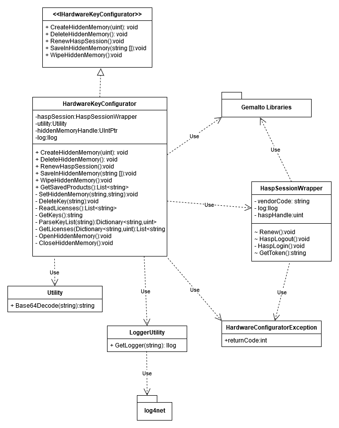

# Hardware Key Creation Tool
*Added 7/1/2020*

## UML Diagram

## IHardwareKeyConfigurator

Interface definition for the HardwareKeyConfigurator object.
Contains the following methods:

### CreateHiddenMemory(uint sizeInMBs)
Creates a hidden memory on the hardware key, which is sized in megabytes defined by the uint parameter.

### DeleteHiddenMemory()
Deletes any hidden memory that is on the HardwareKey.

### RenewHaspSession()
Opens a hasp login session. If any IHardwareKeyConfigurator method fails, then RenewHaspSession must be called before calling any of the other IHardwareKeyConfigurator methods.

### SaveInHiddenMemory(string[] licenses)
Saves an array of license strings in the hidden memory. The key for each license string is a combination of the product specified in the license and feature name. Defined as {ProductName}{FeatureName}. The value is the license string itself.

### WipeHiddenMemory()
Clears all key-value pairs in the hidden memory, but retains the hidden memory itself.

## HardwareKeyConfigurator
Class, primary implementation of IHardwareKeyConfigurator.

### Properties
haspSession- A HaspSessionWrapper object for managing the hasp login session.
utility- A Utility object used for decoding base 64 encoded strings.
hiddenMemoryHandle- A UIntPtr that is the handle for the hidden memory on the hardware key.
log- An Ilog object from the log4net library used for logging.

### GetSavedProducts()
Returns a list of the products that have licenses saved in the hidden memory. This is something I wrote when testing and it's unclear how necessary it is yet. I may add it to IHardwareKeyConfigurator interface if deemed important.

### SetHiddenMemory(string key, string value)
Method that sets a key-value pair in the hidden memory.

### DeleteKey(string key)
Deletes the key-value pair specified by the parameter from the hidden memory.

### ReadLicenses()
Reads the license strings from the hidden memory and returns them as a list.

### GetKeys()
Gets the list of keys from the hidden memory in XML form.

### ParseKeyList(string keylist)
Parses the keys from the XML, as well as the value in bytes allocated in memory to each key. Returns the keys and their associated number of bytes as a Dictionary<string,uint>.

### GetLicenses(Dictionary<string,uint> keyValuePairs)
Uses the Dictionary of key's and their allocated number of bytes in memory to retrieve the license strings from the hidden memory.

### OpenHiddenMemory()
Opens the hidden memory and sets the hiddenMemoryHandle property.

### CloseHiddenMemory()
Closes the hidden memory and sets the hiddenMemoryHandle property to 0.

## HaspSessionWrapper
Wrapper class for managing the hasp login session.

### Properties
vendorCode- a string used to open a hasp login session.
log- an ILog object from the log4net library used for logging.
haspHandle- a memory address/handle to the hasp login session with the hardware key.

### Renew()
Calls HaspLogin() if a hasp session is not already open.

### HaspLogout()
Logs out of the hasp session.

### HaspLogin()
Logs into the hasp session.

### GetToken()
Retrieves the token/fingerprint from the Gemalto hardware key and returns it as a string.

## HardwareConfiguratorException
An exception class for throwing exception when HardwareKeyConfigurator operations don't succeed.

### Properties
The HardwareConfiguratorException has one property, an int ReturnCode, which has values that come from the following sources:
The IHardwareKey methods will return 0 in case of success. Otherwise, non successful return values can be associated to three sources:
1. The Gemalto hidden memory LDK for reading and writing to the hidden memory. The associated return codes can be found on p.27-28 of the Sentinel Drive Protected Memory API reference.
2. The Aladdin.Hasp library which various information related to the hardware key, such as the token/fingerprint value.The associated return codes can be found in AladdinHaspReturnCodes.pdf
3. The NonHaspExceptions enum, which reports exceptions that occur internally in the Hardware Key Client library. They are described in the table below.

| Name/Value | Associated Issue |
|----------|----------------|
| GENERAL_FAILURE=-1 | A system error of some kind was thrown during the course of operation |
| KEY_VALUE_PAIR_SIZE_ZERO_FAIL=-2 | One of the keys in the hidden memory dictionary has an associated stored value that is an empty string |
| HIDDEN_MEMORY_XML_FAIL=-3 | A error was thrown when attempting to parse the xml form of the key list retrieved from the hidden memory |
| KEY_FINGERPRINT_EMPTY=-4 | The value returned for the hardware key fingerprint was an empty string |
| KEY_FINGERPRINT_XML_FAIL=-5 | An error occurred when attempting to install one of the license strings from the hidden memory in the RMS license manager |

## LoggerUtility
Static class for retrieving the ILog object for each class.

### GetLogger(string)
Method to retrieve the Ilog object. Doesn't actually need to receive the string parameter, as it is automatically pulled from the calling class's filepath.

## Utility
Utility class to contain utility methods, currently only has one method.

### Base64Decode(string encodedString)
Method to decode a base 64 encoded string and return it as plain text.
